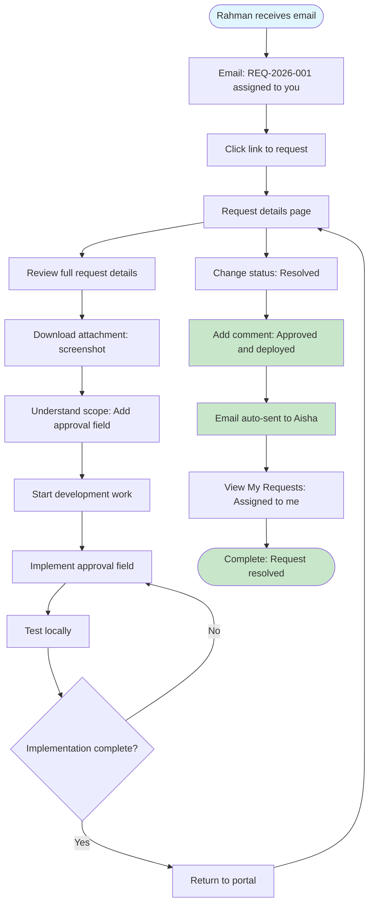

# UX Design Specification - Internal Software Change Request Portal

**Author:** Ahammadali
**Date:** 2026-04-16

---

## Executive Summary

### Project Vision

A focused internal web portal where university staff submit structured software change requests and receive real-time email status updates. The software team gains a centralized dashboard to see, prioritize, assign, and track all requests. The portal transforms chaos (email, chat, conversations) into clarity (structured submission, ownership, tracking).

**Core UX Insight:** Email is the comfort zone for communication, but terrible for tracking. The portal captures structure; email delivers peace of mind.

### Target Users

**Requesters (Primary):**
- **Who:** Administrative staff, faculty office staff, department coordinators, operations staff
- **Usage Pattern:** Sporadic but important — submit when problem arises, not daily busywork
- **Goal:** "I submit once and forget about it — updates come to my inbox"
- **Tech Savviness:** Mixed technical proficiency — need simple, guided experience

**Handlers (Primary):**
- **Who:** Software development team
- **Usage Pattern:** Daily workflow — dashboard, triage, assignment, status updates
- **Goal:** "One place to see everything, prioritize by business need, assign ownership clearly"
- **Tech Savviness:** Highly technical — need powerful filtering and management tools

**Admin (Secondary - Phase 2):**
- **Who:** System administrators
- **Goal:** "Analytics dashboard, metrics, workload balancing"
- **Usage Pattern:** Periodic review and reporting

### Key Design Challenges

1. **Balancing Simplicity vs. Power:** Simple submission form for non-technical staff vs. powerful filtering/dashboard for software team
2. **Email-First UX:** Status updates come to inbox, not portal — requires careful notification design
3. **Mobile-First Support:** Full mobile responsiveness while maintaining desktop dashboard power
4. **Sporadic Usage Pattern:** Requesters don't use it daily — onboarding and re-learning curve matters
5. **University Brand Integration:** IIUM colors (Teal #008670, Gold #CDB067), typography, design principles must be applied consistently

### Design Opportunities

1. **Emotional Relief Moments:** Confirmation email, "In Progress" notification — these are the "aha moments" that differentiate the experience
2. **Clarity Through Structure:** Form fields that guide good requests (reducing back-and-forth clarification)
3. **Visual Ownership:** Clear assignment visualization for software team (who owns what?)
4. **Progress Transparency:** Request history, status timeline, assigned developer — all visible and trackable
5. **Mobile Status Checking:** Quick mobile view for requesters on-the-go (push notification to check portal)

---

## Core User Experience

### Defining Experience

**Primary User Actions:**

**For Requesters (Staff):**
- Submit structured software change requests through an intuitive form
- Receive email updates automatically without checking the portal
- Check request status on-demand (mobile-friendly access)

**For Handlers (Software Team):**
- View all incoming requests in a centralized dashboard
- Filter, prioritize, and assign requests efficiently
- Update status and communicate with requesters seamlessly

**Core Value Exchange:** Requesters trade structure for clarity. Software team trades chaos for visibility. Email serves as the communication bridge.

### Platform Strategy

**Platform Approach:**

**Web Application (SPA):**
- Single Page Application built with React
- Responsive design spanning Desktop, Tablet, Mobile
- No native mobile app required (web covers all form factors)

**Input Modalities:**

**Desktop (Primary for Software Team):**
- Mouse + keyboard interaction
- Multi-column dashboard layout
- Power user features: advanced filtering, bulk operations (Phase 2)

**Mobile/Tablet (Primary for Requesters):**
- Touch-first interaction
- Simplified, stacked vertical layouts
- Optimized form fields (larger inputs, touch-friendly targets)
- Hamburger menu navigation

**Responsive Breakpoints:**
- Mobile: < 640px (small phones)
- Tablet: 640px - 1024px (tablets, small laptops)
- Desktop: > 1024px (standard desktop)

**No Offline Requirement:**
- Always requires internet connection
- Real-time email notifications require connectivity

**Device Capabilities:**
- File uploads: Attachments (screenshots, documents, max 5MB)
- Camera: Potential Phase 2 feature for mobile photo uploads

### Effortless Interactions

**Submit Once, Forget Forever:**
- Form submission is the primary requester interaction — make it count
- Clear field labels guide complete information (reducing back-and-forth)
- Immediate email confirmation = relief and closure
- No need to return to portal unless desired

**Zero-Friction Status Tracking:**
- Email delivers all updates automatically
- Portal available for on-demand status checks
- No manual follow-up required — notifications come to you

**Dashboard Clarity:**
- All requests visible in one place
- Filtering by status, priority, department, type
- Visual ownership: who's assigned to what
- One-click status updates with automatic notifications

**Intuitive Form Design:**
- Fields guide good requests (request type, urgency, system affected, description, attachments)
- Validation provides clear error messages
- Progress indicators for multi-step forms (if needed)
- Help contextual guidance where needed

### Critical Success Moments

**Requester Journey:**

1. **Submission Moment:** Form submit → immediate email confirmation = relief
   - *Success criterion:* Email arrives within 1 minute

2. **Progress Moment:** "In Progress" email notification = "someone saw it!"
   - *Success criterion:* No more wondering "did anyone see this?"

3. **Closure Moment:** "Resolved" email notification = completion
   - *Success criterion:* Request can be closed mentally

**Software Team Journey:**

1. **Dashboard Opening:** See everything in one place = clarity
   - *Success criterion:* No more hunting through email threads

2. **Assignment Moment:** Assign to developer = ownership established
   - *Success criterion:* Clear who owns what

3. **Update Moment:** Change status → automatic email sent = communication handled
   - *Success criterion:* No manual "I'm working on this" emails

**Failure Modes:**
- Email notifications not arriving = reverts to email chaos
- Form submission fails with unclear error = user frustration, abandonment
- Dashboard doesn't show critical requests = missed work, frustrated team

### Experience Principles

**Guiding Principles for UX Decisions:**

1. **Email-First Transparency:** Updates come to you, you don't chase them. The portal captures structure; email delivers peace of mind.

2. **Clarity Over Complexity:** Simple, guided form structure reduces back-and-forth clarification. Show, don't tell.

3. **Visual Ownership:** Who's working on what is always visible. Requesters and software team both know who owns each request.

4. **Sporadic-Usage-Friendly:** Design for users who haven't visited in weeks. Intuitive on return without re-learning. Clear patterns, discoverable interactions.

5. **Responsive-First Design:** Mobile is not an afterthought — full mobile support from day one. Touch-optimized where appropriate, desktop-optimized where needed.

---

## Desired Emotional Response

### Primary Emotional Goals

**Unburdened Clarity**

**For Requesters (Staff):**
- **Primary:** Relief — "I don't have to chase anyone for this"
- **Secondary:** Trust, Confidence, Satisfaction

**For Software Team:**
- **Primary:** Clarity — "I can finally see everything"
- **Secondary:** Control, Efficiency, Organization

**Emotional Differentiator:** Unlike overwhelming enterprise ITSM tools or chaotic email approach, this portal feels simple, clear, and respectful of everyone's time.

### Emotional Journey Mapping

| Stage | Requesters | Software Team |
|-------|-----------|---------------|
| **First discovery** | Curiosity, hope | Skepticism ("will this actually help?") |
| **First use** | Relief, confirmation | Pleasant surprise ("this is easier than email") |
| **Core action** | Ease, confidence | Efficiency, control |
| **Task complete** | Satisfaction, closure | Accomplishment, progress visible |
| **Something goes wrong** | Concern, but recovery path exists | Frustration, but clarity on how to fix |
| **Return usage (weeks later)** | Confidence — "I remember how to use this" | Competence — "I can manage my workload" |

### Micro-Emotions

**Most Critical for Success:**
- **Confidence → Confusion:** Requesters need to feel they're doing it right
- **Trust → Skepticism:** Staff need to believe the system actually works
- **Relief → Anxiety:** No more "did anyone see this?" anxiety

**Secondary:**
- **Accomplishment → Frustration:** Software team feels productive, not overwhelmed
- **Clarity → Confusion:** Who owns what is always visible
- **Empowerment → Helplessness:** Requesters feel they can solve problems, not stuck

### Design Implications

**To create CONFIDENCE:**
- Clear form labels guide good submissions
- Validation messages explain what's needed (not just errors)
- Help documentation is discoverable and contextual
- Form fields are intuitive and well-organized

**To create TRUST:**
- Immediate email confirmation = "it worked"
- Status updates in inbox = "things are moving"
- Request history = "nothing is lost"
- Consistent, reliable notification delivery

**To create RELIEF:**
- Form submission is simple and quick (under 3 seconds)
- Confirmation email is immediate and reassuring
- No follow-up required — notifications come to you

**To create CLARITY (Software Team):**
- Dashboard shows all requests in one place
- Filtering and sorting by status, priority, department, type
- Visual ownership indicators (who owns what)
- One-click status updates with automatic notifications

**To create CONTROL:**
- Easy assignment workflow
- Clear status progression
- Bulk operations (Phase 2)
- Workload visibility

### Emotional Design Principles

**Guiding Principles for Emotional Design:**

1. **Reassurance Through Transparency:** Every action provides immediate feedback. Confirmation emails, status updates, progress indicators — users always know what's happening.

2. **Reduce Cognitive Load:** For sporadic users, the interface should be intuitive on return. Clear labels, discoverable actions, recognizable patterns.

3. **Progress Visibility:** For requesters, "is anyone working on this?" is answered through email. For software team, "what's my workload?" is answered through dashboard.

4. **Error Recovery with Dignity:** Things will go wrong (file too large, form incomplete). Error messages should be helpful, not shameful. Recovery paths should be clear and discoverable.

5. **Respect Everyone's Time:** The portal is designed to eliminate time-wasting — chasing requests, hunting through emails, back-and-forth clarification. Speed and efficiency signal respect.

6. **Emotional Balance:** The experience balances warmth (we're here to help) with professionalism (this is a work tool). Not too cold, not too casual.

---

## UX Pattern Analysis & Inspiration

### Inspiring Products Analysis

**1. ServiceNow (Enterprise Service Management)**
- **What it does well:** Single entry point for all service requests, clean form-based submission, real-time status visibility
- **Key UX strength:** Guided categorization - users don't need to know technical terms, the form guides them
- **What keeps users returning:** One portal for everything - HR, IT, Facilities - creates habit formation

**2. Jira Service Management (Atlassian)**
- **What it does well:** Powerful request dashboard for handlers, simple customer portal for requesters, transparent status workflow
- **Key UX strength:** Separation of concerns - simple submission experience for customers, rich management interface for agents
- **What keeps users returning:** Email notifications keep everyone in the loop without logging in

**3. DBS Bank Internal Tools (Reference from Brief)**
- **What it does well:** Focused scope for specific workflows, real-time status updates, clear ownership visualization
- **Key UX strength:** Purpose-built for specific organizational context, not generic enterprise tooling
- **What keeps users returning:** Solves specific pain points directly without complexity overload

**4. University Employee Portals (e.g., HR, Finance self-service)**
- **What it does well:** Simple, task-based interface - staff come for specific actions (leave application, payslip view)
- **Key UX strength:** Sporadic-usage friendly - interface remains intuitive even for infrequent users
- **What keeps users returning:** Required tasks funnel through portal, but experience is respectful of time

### Transferable UX Patterns

**Navigation Patterns:**

- **Single-purpose home page** - Clear call-to-action ("Submit Request") for requesters, dashboard view for handlers
- **Role-based entry points** - Different landing experiences based on user role (requester vs handler)
- **Breadcrumbs with context** - Always show where you are in the request workflow

**Interaction Patterns:**

- **Progressive form disclosure** - Show relevant fields based on request type (reduces cognitive load)
- **One-click status updates** - Handlers change status with single click, automatic email notification
- **Real-time validation** - Form fields validate as you type, not just on submit
- **Inline help contextual guidance** - Tooltips or helper text next to complex fields (not separate help pages)

**Visual Patterns:**

- **Status badges with color coding** - Visual status indicators (Open = gray, In Progress = blue, Resolved = green, Closed = dark)
- **Assignment avatars** - Show who owns a request with profile pictures or initials
- **Activity timeline** - Vertical timeline showing request history (submitted → assigned → in progress → resolved)
- **Card-based dashboard layout** - Requests displayed as cards with key info visible at a glance

**Email-First Patterns:**

- **Rich email notifications** - Status emails include request details, current status, assigned person, and link to portal
- **Reply-to-email option** - Advanced pattern: allow users to reply to notification email to add comments (Phase 2)
- **Digest notifications** - Optional daily/weekly digest for handlers with multiple requests

### Anti-Patterns to Avoid

**Enterprise ITSM Over-complexity:**
- Generic enterprise tools like ServiceNow try to do everything - creates confusion
- **Avoid:** Too many fields, complex categorization trees, approval workflows for simple requests
- **Why:** University staff need simplicity, not ITIL framework complexity

**"Ticket Number" First Experience:**
- Many IT tools show ticket numbers prominently as the primary identifier
- **Avoid:** Making users memorize ticket numbers - search and filters are better
- **Why:** Creates mental overhead; staff should search by description, department, or date

**Hidden Status Workflow:**
- Some tools have complex state machines that aren't visible to users
- **Avoid:** Status progression that's unclear or has hidden states
- **Why:** Violates "Progress Visibility" emotional goal - users need to know what's happening

**Portal-Only Notifications:**
- Tools that require users to log in to see status updates
- **Avoid:** Making users check the portal for status changes
- **Why:** Email is the comfort zone; portal-only notifications create anxiety

**Blank-Form Syndrome:**
- Forms with no guidance or examples, expecting users to know what to write
- **Avoid:** Empty description fields without placeholder examples or help text
- **Why:** Leads to incomplete submissions, back-and-forth clarification

### Design Inspiration Strategy

**What to Adopt:**

- **Jira Service Management's role separation** - Simple portal for requesters, powerful dashboard for handlers. This aligns perfectly with our two-user-type model.

- **ServiceNow's guided categorization** - Form fields that guide users to provide complete information without requiring technical knowledge. Reduces back-and-forth clarification.

- **DBS Bank's focused scope** - Purpose-built for specific organizational context, not generic. This keeps the tool simple and relevant.

- **University portal sporadic-usage patterns** - Interfaces that remain intuitive even for infrequent users. Clear labels, discoverable actions, recognizable patterns.

**What to Adapt:**

- **Progressive form disclosure from Typeform** - Show fields conditionally based on request type. Adapt for enterprise context: keep it professional, not conversational.

- **Card-based dashboard from Trello/Asana** - Visual card layout for requests. Adapt with IIUM brand colors and status workflow.

- **Rich email notifications from GitHub** - Detailed status emails with all context. Adapt for university staff: simpler language, no technical jargon.

- **Activity timeline from Linear** - Clean vertical timeline showing request history. Adapt with IIUM visual design system.

**What to Avoid:**

- **ServiceNow's complexity** - Too many fields, complex categorization. Keep focused on software change requests only.

- **Jira's project-centric navigation** - Jira organizes by projects. Our portal is simpler: all requests in one place, filtered by status/priority/department.

- **Enterprise approval workflows** - Multi-level approvals create delays. MVP: direct assignment to software team.

- **Ticket-number dependence** - Don't make users memorize ticket numbers. Search and filters are better.

**This strategy keeps IIUM Change Request Portal simple while leveraging proven patterns from successful internal tools.**

---

## Design System Foundation

### Design System Choice

**shadcn/ui + IIUM Design Language System Integration**

For the IIUM Change Request Portal, we're taking a **hybrid approach** that combines proven component foundations with strong brand identity:

1. **Component Foundation:** shadcn/ui
   - Pre-built, accessible React components
   - Fully customizable with Tailwind CSS
   - Copy-paste components, full ownership
   - Perfect for Tailwind-based projects

2. **Brand Layer:** IIUM Design Language System
   - Colors: Teal #008670, Gold #CDB067
   - Typography: Roboto Slab (headings), Inter (UI), Barlow Condensed (labels)
   - Design principles: No logo distortions, no drop shadows, no busy backgrounds

3. **Implementation:** Custom theme layer
   - shadcn/ui components themed with IIUM colors
   - Typography scale from IIUM DLS
   - Component variants aligned with IIUM principles

### Rationale for Selection

**Why this hybrid approach:**

- **Speed:** shadcn/ui provides production-ready components immediately — no building from scratch
- **Brand Compliance:** Full customization capability ensures IIUM brand consistency
- **Accessibility:** shadcn/ui components follow WCAG standards out of the box
- **Ownership:** Components are copied into your codebase — full control, no dependency lock-in
- **Team Fit:** Tailwind CSS expertise transfers directly to component customization
- **Maintenance:** Active community, regular updates, but you control when to adopt

**Why NOT other approaches:**

- **Pure custom:** Too slow, reinventing well-solved accessibility problems
- **Material Design/Ant Design:** Would conflict with IIUM brand requirements
- **MUI/Chakra UI:** More abstraction than needed; shadcn/ui is closer to Tailwind

### Implementation Approach

**Phase 1: Design Token Configuration**

Configure shadcn/ui with IIUM design tokens:

```javascript
// tailwind.config.js
{
  theme: {
    extend: {
      colors: {
        iium: {
          turquoise: '#00928F', // PANTONE 7716 C - Official IIUM Turquoise
          gold: '#D59F0F',      // PANTONE 7555 C - Official IIUM Gold
          black: '#000000',
          white: '#FFFFFF',
          dark: '#030F0D',
          // Kulliyyah accent colours...
        }
      },
      fontFamily: {
        heading: ['Roboto Slab', 'serif'],
        body: ['Inter', 'sans-serif'],
        label: ['Barlow Condensed', 'sans-serif'],
      }
    }
  }
}
```

**Phase 2: Component Customization**

Customize shadcn/ui component variants:

- **Buttons:** Primary (teal), Secondary (gold), Ghost, Outline variants
- **Forms:** Input, Select, Textarea styled with IIUM borders and focus states
- **Cards:** Clean design without shadows (per IIUM principles)
- **Badges:** Status color coding (Open, In Progress, Resolved, Closed)
- **Avatars:** User assignment visualization with initials

**Phase 3: Custom Component Development**

Create IIUM-specific components not in shadcn/ui:

- **RequestCard:** Display request with status, priority, assignee
- **ActivityTimeline:** Vertical timeline showing request history
- **StatusBadge:** IIUM-colored status indicators
- **RequestForm:** Progressive disclosure form for submissions

### Customization Strategy

**Design Token Mapping:**

| IIUM VIS Token | Tailwind Variable | Usage |
|----------------|-------------------|-------|
| Turquoise Primary | `--color-iium-turquoise` | Primary actions, links, emphasis |
| Gold Accent | `--color-iium-gold` | Secondary actions, highlights |
| Deep Background | `--color-iium-dark` | Footer, deep backgrounds |
| Roboto Slab | `--font-heading` | Page titles, section headings |
| Inter | `--font-body` | Body text, UI elements |
| Barlow Condensed | `--font-label` | Labels, buttons, tags |

**Component Variant Strategy:**

- **Status Badges:** Semantic colors mapped to workflow states
  - Open: Gray (neutral)
  - In Progress: Blue (active work)
  - Resolved: Turquoise (success, brand-aligned)
  - Closed: Dark (finalized)

- **Buttons:** Clear visual hierarchy
  - Primary: Turquoise background, white text (main actions)
  - Secondary: Gold background, dark text (accent actions)
  - Ghost: Transparent background, turquoise text (subtle actions)

- **Form Fields:** Clean, accessible design
  - Focus ring: Turquoise (brand-aligned, accessible)
  - Error state: Red (standard pattern)
  - Help text: Gray (subtle guidance)

**Responsive Design Foundation:**

- Mobile-first approach built into Tailwind utilities
- Breakpoints: <640px (mobile), 640-1024px (tablet), >1024px (desktop)
- Component variants adapt across breakpoints
- Touch-friendly targets on mobile (min 44px tap targets)

---

## Core User Experience

### Defining Experience

**"Submit Once, Forget Forever"**

The core interaction that defines the IIUM Change Request Portal: Staff submit a structured request through a simple form → receive immediate email confirmation → receive automatic status updates in their inbox → never need to follow up manually.

This is the interaction that makes users feel successful and relieved. It's the moment when staff realize they don't have to chase anyone anymore — the system handles communication for them.

**Why this matters:**

- **For requesters:** Transforms anxiety (did anyone see this?) into relief (updates come to me)
- **For software team:** Transforms chaos (email everywhere) into clarity (structured, centralized requests)
- **For the organization:** Establishes trust in digital processes — people see that submitting requests actually works

### User Mental Model

**How users currently solve this problem:**

1. Send an email to the software team
2. Wait and wonder if anyone saw it
3. Follow up with another email
4. Maybe get a response, maybe not
5. No way to track progress

**Mental model they bring:**

- "Email is how I communicate"
- "I need to follow up or things get forgotten"
- "I have no visibility into what's happening"
- "The squeaky wheel gets the grease"

**What makes this different:**

- **Portal captures structure:** Not just an email body — guided fields ensure complete information
- **Email delivers peace of mind:** Automatic updates, no manual follow-up required
- **Status is always visible:** But doesn't require checking — email brings status to you

**The mental shift:** From "I need to chase this" to "I'll be notified automatically."

### Success Criteria

**When do users say "this just works"?**

✅ **Form submission completes in under 60 seconds**  
✅ **Email confirmation arrives within 1 minute**  
✅ **Status changes automatically trigger email notifications**  
✅ **Never need to email or call to check status**  
✅ **Request history is always visible if needed**

**Success Indicators:**

- **Time to completion:** Form open → submission in under 3 minutes
- **Zero follow-up emails:** Staff don't need to email or call to check status
- **Email-driven awareness:** Staff can describe request status without logging in (because email told them)
- **First-use success:** Users successfully submit on first try without confusion
- **Return success:** Users who haven't visited in weeks can still successfully submit (sporadic-usage friendly)

### Novel UX Patterns

**This uses ESTABLISHED patterns with a unique twist:**

**Established patterns we're adopting:**

- **Form-based submission:** Like Google Forms, Typeform — familiar interaction
- **Status workflow:** Open → In Progress → Resolved → Closed — standard progression
- **Email notifications:** Like Jira, GitHub — proven pattern for keeping users informed
- **Dashboard for handlers:** Like Trello, Asana — visual request management

**Our unique twist:**

1. **Email-First UX:** Status updates are delivered via email, not portal. The portal is for submission and on-demand checking, but email is the primary communication channel. This acknowledges user behavior — email is the comfort zone.

2. **Sporadic-usage optimized:** Form is designed for users who haven't visited in weeks. Intuitive on return without re-learning. Clear labels, discoverable actions, recognizable patterns.

3. **University context:** Form fields and categories speak the language of university operations (forms, reports, workflows, leave applications). Not generic "IT request" language.

**Why this matters:**

- **No learning curve:** Staff already know how to fill forms and check email
- **Immediate value:** First use delivers relief — no training required
- **Sustainable adoption:** Sporadic users don't need to re-learn the interface

### Experience Mechanics: Submit a Request

The step-by-step flow for the defining experience:

#### 1. Initiation

**Entry point:**
- Clear "Submit Request" button on homepage (prominent, teal color)
- Direct URL access (bookmarks, links from emails)

**Trigger:**
- Staff member has a software issue or enhancement need
- "The leave form is missing a field" or "This report export is broken"

**Invitation:**
- Friendly welcome message: "Describe what you need, and we'll take it from there"
- Reassurance: "You'll receive email updates at every step"

#### 2. Interaction

**Step 1: Request Type Selection (guided, not just a dropdown)**

Clickable cards with icons and descriptions:
- 🐛 **Bug Report:** Something isn't working correctly
- 📝 **Form Change:** Add, remove, or modify form fields
- 📊 **Report Change:** Modify or create new reports
- ⚙️ **Workflow Improvement:** Process or efficiency enhancement
- 🔧 **Other:** Software-related requests not listed above

*Selection reveals relevant fields (progressive disclosure)*

**Step 2: Essential Details**

- **Title:** Short, descriptive text input
  - Placeholder: "e.g., Add supervisor approval field to leave application"
  - Validation: Required, min 10 characters

- **Urgency:** Radio buttons with time indicators
  - Low: "Not urgent — 2+ weeks is fine" (gray)
  - Medium: "Needed within 1 week" (yellow/gold)
  - High: "Needed within 2-3 days" (orange)
  - Critical: "Urgent — needed within 24 hours" (red)

- **System Affected:** Dropdown of university systems
  - Leave Portal, Course Management, Student Information System, Reporting Portal, Other

- **Description:** Large text area with guidance
  - Placeholder examples: "Describe what's not working or what you need changed. Include steps to reproduce if reporting a bug."
  - Help text: "The more detail you provide, the faster we can help"
  - Validation: Required, min 50 characters

**Step 3: Attachments (Optional)**

- File upload button (screenshots, documents, max 5MB)
- Visual progress indicator during upload
- List of uploaded files with remove option

**Step 4: Review & Submit**

- Summary card showing all entered information
- "Submit Request" button (prominent, teal color, bottom-right)
- Cancel button (secondary, ghost style)

#### 3. Feedback

**Real-time feedback:**

- **Field validation:** As-you-type validation with green checkmarks / red borders
- **Form progress:** "Step 1 of 3" indicator or progress bar at top
- **Save draft:** Auto-save to local storage (prevent data loss)

**Success feedback:**

- **Submit button:** Changes to "Submitting..." with spinner → "Success!" with checkmark animation
- **Success message:** "Your request has been submitted successfully."
- **Reference number:** "REQ-2026-001" displayed prominently
- **Reassurance:** "Check your email for confirmation. You'll receive updates as your request progresses."

**Error feedback:**

- **Validation errors:** Clear, specific messages below each field
  - "Please describe the issue in at least 10 characters"
  - "Please select a request type"
- **File upload fails:** "File too large. Maximum size is 5MB." with retry option
- **Submit fails:** "Something went wrong. Please try again or contact support."
- **Recovery path:** Clear next steps, no technical jargon

#### 4. Completion

**Confirmation screen:**

- **Success message:** "Request submitted successfully"
- **Request reference:** "REQ-2026-001" (clickable to view details)
- **Reassurance text:** "You'll receive email updates as your request progresses. No need to follow up."
- **Action buttons:**
  - "View My Requests" (primary)
  - "Submit Another Request" (secondary)
  - "Return to Home" (ghost)

**Immediate email (within 1 minute):**

```
Subject: [IIUM Software Portal] Request Received: REQ-2026-001

Your request has been received and is being reviewed.

Request: Add supervisor approval field to leave application
Reference: REQ-2026-001
Status: Open

You'll receive email notifications as your request progresses.

View your requests: [link to portal]
```

**Ongoing email notifications:**

Every status change triggers an automatic email with:
- Current status
- Assigned developer (if applicable)
- Link to request details

**Closure:**

"Resolved" email = mental closure. Request can be archived mentally.

### Experience Mechanics: Handler Dashboard

**Core interaction for software team:**

**1. Dashboard Opening**
- See all requests in one place (card-based layout)
- Filter by status, priority, department, type
- Visual ownership: who's assigned to what

**2. Triage & Assignment**
- Click request card to view details
- Assign to developer (dropdown or search)
- Set priority (if not set by requester)
- One-click status change → automatic email sent

**3. Update & Communicate**
- Update status with comment
- Email automatically sent to requester
- Request history captured in timeline

**Success for software team:**
- No more hunting through email threads
- Clear ownership and workload visibility
- One-click status updates handle communication automatically

---

## Visual Design Foundation

### Color System

**IIUM Brand Colors (Official Visual Identity System 2021):**

| Color | Hex | Pantone | Usage |
|-------|-----|---------|-------|
| **Turquoise (Primary)** | #00928F | PANTONE 7716 C | Primary actions, links, emphasis, brand identity |
| **Gold (Accent)** | #D59F0F | PANTONE 7555 C | Secondary actions, highlights, visual interest |
| **Deep Background** | #030F0D | Custom | Footer, deep backgrounds, high contrast areas |

**Semantic Color Mapping:**

| Semantic | Hex | Usage |
|----------|-----|-------|
| **Primary** | #00928F (Turquoise) | Main CTAs, active states, key interactions |
| **Secondary** | #D59F0F (Gold) | Secondary CTAs, highlights, accents |
| **Success** | #00928F (Turquoise) | Success states, resolved status, completion |
| **Warning** | #D59F0F (Gold) | Medium urgency, attention needed |
| **Error** | #DC2626 (Red) | Error states, critical urgency, validation failures |
| **Info** | #3B82F6 (Blue) | Information, in-progress status, neutral feedback |
| **Neutral** | #6B7280 (Gray) | Open status, disabled states, subtle text |

**Status Color Coding (Workflow):**

| Status | Color | Rationale |
|--------|-------|-----------|
| **Open** | Gray (#6B7280) | Neutral — awaiting triage |
| **In Progress** | Blue (#3B82F6) | Active — work is happening |
| **Resolved** | Turquoise (#00928F) | Success — brand-aligned completion |
| **Closed** | Dark (#030F0D) | Finalized — complete workflow |

**Accessibility Compliance:**

- Turquoise on White: Contrast ratio ≥ 4.5:1 (WCAG AA compliant)
- Gold on Dark: Use dark text for contrast (gold as background)
- Red/Blue for Status: Standard semantic colors, accessibility-tested
- Focus States: Turquoise ring (2px) — visible, brand-aligned, accessible

### Typography System

**IIUM Typefaces:**

| Typeface | Usage | Font Family |
|----------|-------|-------------|
| **Roboto Slab** | Headings (H1-H6) | Serif, professional, academic |
| **Inter** | Body text, UI elements | Sans-serif, readable, modern |
| **Barlow Condensed** | Labels, buttons, tags | Condensed, space-efficient |

**Type Scale:**

| Element | Size | Weight | Line Height | Font Family |
|---------|------|--------|-------------|-------------|
| **H1** | 2.5rem (40px) | 700 | 1.2 | Roboto Slab |
| **H2** | 2rem (32px) | 700 | 1.3 | Roboto Slab |
| **H3** | 1.5rem (24px) | 600 | 1.4 | Roboto Slab |
| **H4** | 1.25rem (20px) | 600 | 1.4 | Roboto Slab |
| **Body Large** | 1.125rem (18px) | 400 | 1.6 | Inter |
| **Body** | 1rem (16px) | 400 | 1.6 | Inter |
| **Body Small** | 0.875rem (14px) | 400 | 1.5 | Inter |
| **Label/Button** | 0.875rem (14px) | 600 | 1.4 | Barlow Condensed |
| **Caption** | 0.75rem (12px) | 400 | 1.4 | Inter |

**Typography Hierarchy:**

- **H1:** Page titles (e.g., "Submit a Request")
- **H2:** Section headings (e.g., "Request Details", "Request History")
- **H3:** Card titles (e.g., request title in dashboard)
- **H4:** Subsection headings (e.g., "Attachments", "Comments")
- **Body:** Main content, descriptions, help text
- **Body Small:** Metadata, timestamps, secondary info
- **Label/Button:** Interactive elements, form labels
- **Caption:** Disclaimers, fine print

**Accessibility Considerations:**

- Minimum font size: 14px for body text (16px recommended)
- Line height: 1.5-1.6 for body text (readability)
- Font weight: Minimum 400 for body, 600 for headings
- Letter spacing: Normal for body, +0.01em for headings (optional)

### Spacing & Layout Foundation

**Spacing System (8px base unit):**

| Token | Value | Usage |
|-------|-------|-------|
| **space-1** | 4px | Tight spacing, icon padding |
| **space-2** | 8px | Small gaps, button padding |
| **space-3** | 12px | Compact spacing |
| **space-4** | 16px | Default spacing, card padding |
| **space-6** | 24px | Section spacing |
| **space-8** | 32px | Large section spacing |
| **space-12** | 48px | Page margins |
| **space-16** | 64px | Hero sections |

**Component Spacing:**

- Card padding: 16px (space-4)
- Button padding: 8px 16px (space-2 space-4)
- Form field gap: 16px (space-4)
- Section gap: 24px (space-6)
- Page margins: 24px on mobile, 48px on desktop (space-6 space-12)

**Layout Principles:**

1. **Clean, Uncluttered Design:** Per IIUM principles — no busy backgrounds, no drop shadows
2. **Visual Hierarchy Through Size and Weight:** Not through shadows or gradients
3. **Purposeful White Space:** Spacing creates structure, not decorative elements
4. **Mobile-First Stacking:** Single column on mobile, multi-column on desktop

**Grid System:**

- Mobile: 1 column (full width)
- Tablet: 2 columns (optional)
- Desktop: 12-column grid (standard Tailwind)
- Max-width container: 1280px for large screens

**Component Layout Patterns:**

- Request Card: Vertical stack (title → metadata → status → actions)
- Form: Vertical stack with clear section breaks
- Dashboard: Grid layout (3 columns on desktop, 1 on mobile)
- Sidebar: 240px wide on desktop, hidden on mobile (hamburger menu)

### Accessibility Considerations

**Color Contrast:**

- All text meets WCAG AA (4.5:1 for normal text, 3:1 for large text)
- Interactive elements have clear focus states (2px teal ring)
- Status colors tested for color blindness accessibility

**Typography:**

- Minimum font size: 14px (16px recommended for body)
- Line height: 1.5-1.6 for readability
- Font families: Web-safe, fast-loading Google Fonts

**Touch Targets:**

- Minimum tap target: 44×44px (mobile)
- Button padding: 8px 16px (meets touch target)
- Spacing between interactive elements: 8px minimum

**Keyboard Navigation:**

- All interactive elements keyboard-accessible
- Tab order follows visual layout
- Focus indicators visible (teal ring, 2px)
- Skip links implemented for main content

**Screen Reader Support:**

- Semantic HTML (headings, landmarks, lists)
- ARIA labels where needed (icons, custom components)
- Status announcements for dynamic content
- Form validation errors announced

---

## Design Direction Decision

### Design Directions Explored

Six design direction variations were explored, each with different approaches to layout, visual weight, and interaction patterns:

1. **Clean & Minimal (Professional Academic)** — Maximum white space, typography-driven hierarchy, strong vertical rhythm
2. **Card-Based Dashboard (Visual Organization)** — Information organized into clear card components, grid layout
3. **Progressive Disclosure (Guided Experience)** — Multi-step form wizard, contextual field revelation
4. **Split-Screen Workspace (Handler Power User)** — Three-column layout, persistent navigation, keyboard shortcuts
5. **Email-First Notification Center** — Notification drawer, real-time updates, email-dominant communication
6. **Mobile-First Responsive** — Touch-optimized, hamburger menu, stacked vertical layouts

### Chosen Direction

**Hybrid Approach: Direction 1 + Direction 2 + Direction 3 + Direction 6**

The IIUM Change Request Portal will use a hybrid design approach that combines:

- **Direction 1 (Clean & Minimal)** for requester-facing pages
- **Direction 2 (Card-Based Dashboard)** for software team dashboard
- **Direction 3 (Progressive Disclosure)** for request submission form
- **Direction 6 (Mobile-First Responsive)** applied throughout

**Page-by-Page Design Direction:**

| Page | Design Direction | Rationale |
|------|------------------|-----------|
| Homepage | Direction 1 | Simple, clear call-to-action ("Submit Request") |
| Request Form | Direction 3 | Progressive disclosure guides complete submissions |
| Requester Dashboard | Direction 1 | List view of my requests, clean and minimal |
| Handler Dashboard | Direction 2 | Card-based grid, high information density |
| Request Details | Direction 1 | Vertical timeline, clean layout |
| All Pages | Direction 6 | Mobile-first responsive design |

### Design Rationale

**Why this hybrid approach:**

1. **Role-Specific Experiences:**
   - Requesters (staff) need simplicity — Direction 1 provides clean, uncluttered interface
   - Handlers (software team) need power — Direction 2 provides visual organization and density

2. **University Context Alignment:**
   - Direction 1 aligns with IIUM design principles (no shadows, no busy backgrounds)
   - Professional academic feel appropriate for university environment
   - Typography-driven hierarchy (Roboto Slab headings, Inter body)

3. **Reduced Cognitive Load:**
   - Direction 3 (progressive disclosure) guides users to complete information
   - Reduces back-and-forth clarification between staff and software team
   - Contextual fields based on request type (bug vs. enhancement)

4. **Mobile-First Philosophy:**
   - Direction 6 ensures full mobile functionality from day one
   - Staff can submit requests from any device
   - Touch-friendly targets (44×44px minimum)
   - Responsive design across breakpoints (<640px mobile, 640-1024px tablet, >1024px desktop)

5. **Emotional Goal Alignment:**
   - Clean & minimal design creates relief (no clutter, no confusion)
   - Card-based dashboard creates clarity (visual ownership, status visibility)
   - Progressive disclosure creates confidence (guided experience, no mistakes)

### Implementation Approach

**Phase 1: Foundation (Week 1-2)**

- Configure shadcn/ui with IIUM design tokens (colors, typography)
- Set up responsive grid system (mobile-first)
- Create base components (Button, Card, Form, Badge)

**Phase 2: Requester Experience (Week 3-4)**

- Build homepage with Direction 1 (clean, minimal)
- Build request form with Direction 3 (progressive disclosure)
- Build requester dashboard with Direction 1 (list view)
- Implement mobile responsiveness (Direction 6)

**Phase 3: Handler Experience (Week 5-6)**

- Build handler dashboard with Direction 2 (card-based grid)
- Build request details view with Direction 1 (clean layout)
- Implement filtering, sorting, assignment workflow
- Add keyboard navigation for power users

**Phase 4: Polish & Refine (Week 7-8)**

- Implement email notification system (Direction 5 elements)
- Add activity timeline component
- Accessibility audit and improvements
- Performance optimization
- Browser testing (Chrome, Firefox, Safari, Edge)

**Component Priority:**

1. Button (primary, secondary, ghost) — IIUM colors
2. Form fields (input, select, textarea) — with validation
3. Card component — for request display
4. Badge component — for status indicators
5. Avatar component — for assignment visualization
6. Timeline component — for request history
7. Notification drawer — for notification center (Direction 5)

**Responsive Breakpoints:**

- Mobile: <640px (single column, stacked layout)
- Tablet: 640-1024px (two columns, adjusted layout)
- Desktop: >1024px (full layout, three columns for handler dashboard)

---

## User Journey Flows

### Journey 1: Submit a Software Change Request (Aisha - Administrative Staff)

**User:** Aisha, administrative staff in the Registrar's Office
**Goal:** Submit a request to add a supervisor approval field to the leave application form
**Entry Point:** Homepage "Submit Request" button

**Flow Diagram:**

```mermaid
flowchart TD
    Start([Aisha needs form change]) --> Home[Homepage: IIUM Software Portal]
    Home --> ClickSubmit[Click "Submit Request" button]
    
    ClickSubmit --> RequestType[Request Type Selection]
    RequestType --> SelectForm[Select: Form Change]
    
    SelectForm --> Step2[Step 2: Request Details]
    Step2 --> EnterTitle[Enter title: Add supervisor approval field]
    EnterTitle --> SelectUrgency[Select urgency: Medium 1 week]
    SelectUrgency --> SelectSystem[Select system: Leave Portal]
    SelectSystem --> EnterDescription[Enter description with details]
    
    EnterDescription --> DecisionAttach{Attach screenshot?}
    DecisionAttach -->|Yes| UploadFile[Upload screenshot 2MB]
    UploadFile --> Step4
    DecisionAttach -->|No| Step4[Step 4: Review & Submit]
    
    Step4 --> ReviewSummary[Review request summary]
    ReviewSummary --> DecisionReady{Ready to submit?}
    
    DecisionReady -->|No| EditFields[Edit any field]
    EditFields --> Step4
    
    DecisionReady -->|Yes| ClickSubmit[Click "Submit Request"]
    ClickSubmit --> Validate[Form validation]
    
    Validate --> DecisionValid{Valid?}
    DecisionValid -->|No| ShowErrors[Show validation errors]
    ShowErrors --> Step4
    
    DecisionValid -->|Yes| Submitting[Submitting... spinner]
    Submitting --> Success[Success! Request submitted]
    
    Success --> ConfirmScreen[Confirmation screen: REQ-2026-001]
    ConfirmScreen --> EmailArrives[Email arrives within 1 minute]
    EmailArrives --> MentalClose[Aisha mentally closes task]
    MentalClose --> Done([Complete: Relief achieved])
    
    style Start fill:#e1f5fe
    style Done fill:#c8e6c9
    style Success fill:#c8e6c9
    style EmailArrives fill:#c8e6c9
    style ShowErrors fill:#ffcdd2
```

**Key Interaction Points:**

- **Guided Start:** Large "Submit Request" CTA on homepage — clear starting point
- **Progressive Disclosure:** Request type selection reveals relevant fields
- **Validation Feedback:** Real-time validation with green checkmarks / red borders
- **Success Confirmation:** Reference number + email = relief and closure
- **Email-First UX:** Email arrives within 1 minute — no need to check portal

**Potential Friction Points & Solutions:**

| Friction Point | Solution |
|----------------|----------|
| Unsure which request type to select | Helper text under each option with examples |
| Description field - how much detail? | Placeholder examples + "The more detail, the faster we can help" |
| File upload fails (too large) | Clear error message with retry option |
| Form timeout (session expires) | Auto-save to local storage, restore on return |

---

### Journey 2: Triage and Assign Incoming Requests (Sarah - Software Team Lead)

**User:** Sarah, Software Team Lead
**Goal:** Review incoming requests, assign to developers, set priorities
**Entry Point:** Handler Dashboard

**Flow Diagram:**

```mermaid
flowchart TD
    Start([Sarah opens dashboard]) --> Dashboard[Handler Dashboard: All requests]
    Dashboard --> ViewNew[Filter: Status = Open]
    
    ViewNew --> CardGrid[Card grid: 12 open requests]
    CardGrid --> ScanCards[Scan cards by urgency/title]
    
    ScanCards --> SelectCard[Click card: REQ-2026-001]
    SelectCard --> RequestDetails[Request details slide-in]
    
    RequestDetails --> ReviewInfo[Review request info]
    ReviewInfo --> DecisionComplete{Complete info?}
    
    DecisionComplete -->|No| RequestMore[Click "Request clarification"]
    RequestMore --> EmailSent[Email sent to Aisha]
    EmailSent --> Dashboard
    
    DecisionComplete -->|Yes| SelectPriority[Select priority: Medium]
    SelectPriority --> SelectDev[Assign to: Rahman]
    
    SelectDev --> ChangeStatus[Change status: In Progress]
    ChangeStatus --> EmailAuto[Email auto-sent to Aisha]
    
    EmailAuto --> DecisionNext{Next request?}
    DecisionNext -->|Yes| CardGrid
    DecisionNext -->|No| CloseDashboard[Close dashboard]
    CloseDashboard --> Done([Complete: Requests assigned])
    
    style Start fill:#e1f5fe
    style Done fill:#c8e6c9
    style EmailAuto fill:#c8e6c9
    style RequestMore fill:#fff9c4
```

**Key Interaction Points:**

- **Dashboard Overview:** See all requests at a glance with status badges
- **Quick Filters:** Filter by status, priority, department, type
- **One-Click Actions:** Assign + change status in one interaction
- **Automatic Email:** Status change triggers email automatically
- **Visual Ownership:** Assigned developer avatar visible on card

**Efficiency Optimizations:**

- **Keyboard Navigation:** Arrow keys to navigate cards, Enter to open
- **Bulk Actions:** Shift+click to select multiple, bulk assign (Phase 2)
- **Quick Status Change:** Dropdown in card without opening details
- **Requester History:** See requester's previous requests (context)

---

### Journey 3: Work on Assigned Request (Rahman - Software Developer)

**User:** Rahman, Software Developer
**Goal:** Implement the requested form change, update status
**Entry Point:** Assignment notification email → Portal

**Flow Diagram:**



**Key Interaction Points:**

- **Email to Portal:** Seamless transition from email to request details
- **Full Context:** All request information visible in one place
- **Status Update:** One-click status change with comment
- **Automatic Communication:** Email sent to requester automatically
- **Work Visibility:** "My Requests" view shows all assigned work

---

### Journey 4: Check Request Status (Fatimah - Department Coordinator)

**User:** Fatimah, Department Coordinator
**Goal:** Check status of previously submitted request
**Entry Point:** Homepage "My Requests" link

**Flow Diagram:**

```mermaid
flowchart TD
    Start([Fatimah wants status check]) --> Home[Homepage]
    Home --> ClickMyRequests[Click "My Requests"]
    
    ClickMyRequests --> MyRequests[My Requests page]
    MyRequests --> RequestList[List: 3 requests]
    
    RequestList --> ScanStatus[Scan status column]
    ScanStatus --> SeeStatus[See: REQ-2026-001 In Progress]
    
    SeeStatus --> DecisionSatisfied{Satisfied with status?}
    
    DecisionSatisfied -->|Yes| MentalClose[Mental update: Being worked on]
    MentalClose --> ClosePortal[Close portal]
    ClosePortal --> Done([Complete: Status known])
    
    DecisionSatisfied -->|No| ClickRequest[Click request for details]
    ClickRequest --> RequestDetails[Request details page]
    
    RequestDetails --> ViewTimeline[View activity timeline]
    ViewTimeline --> SeeAssignee[See assigned to: Rahman]
    SeeAssignee --> ViewComments[View comments: Implementation in progress]
    
    ViewComments --> DecisionEmail{Want email updates?}
    DecisionEmail -->|Already enabled| AlreadyEmail[Emails already enabled]
    DecisionEmail -->|Not enabled| EnableEmail[Enable email notifications]
    
    AlreadyEmail --> Done
    EnableEmail --> Done
    
    style Start fill:#e1f5fe
    style Done fill:#c8e6c9
    style SeeStatus fill:#c8e6c9
    style MentalClose fill:#c8e6c9
```

**Key Interaction Points:**

- **Quick Status Check:** "My Requests" shows all requests with status badges
- **Visual Status:** Color-coded badges (Open, In Progress, Resolved, Closed)
- **Activity Timeline:** See full history of who did what, when
- **Assigned Developer:** Know who's working on the request
- **Email Preferences:** Confirm email notifications are enabled

---

### Journey Patterns

**Navigation Patterns:**

- **Breadcrumb Navigation:** Home → My Requests → Request Details
- **Back Button:** Consistent back button for navigation
- **Quick Links:** "My Requests" accessible from header on all pages
- **Email Deep Links:** Emails link directly to relevant request

**Decision Patterns:**

- **Progressive Disclosure:** Show relevant options based on previous selections
- **Confirmation for Critical Actions:** "Are you sure?" for status changes
- **Save Draft:** Auto-save form data to prevent loss
- **Clear Cancel:** Cancel button always available, returns to previous state

**Feedback Patterns:**

- **Real-Time Validation:** Green checkmarks for valid fields, red borders for errors
- **Loading States:** Spinner or skeleton during async operations
- **Success Toasts:** "Request submitted successfully" confirmation
- **Error Recovery:** Clear error messages with next steps, no technical jargon

### Flow Optimization Principles

1. **Minimize Steps to Value:** Get users to success quickly (form submission in under 3 minutes)
2. **Reduce Cognitive Load:** Progressive disclosure, clear labels, contextual help
3. **Provide Clear Feedback:** Validation, loading states, success confirmations
4. **Handle Errors Gracefully:** Specific error messages, recovery paths, no blame
5. **Create Moments of Delight:** Success animations, immediate email confirmation
6. **Respect User Time:** Efficient dashboard for handlers, quick status checks for requesters

---

## Component Strategy

### Design System Components (shadcn/ui)

**Available from shadcn/ui — We'll customize with IIUM tokens:**

| Component | Usage | Customization Needed |
|-----------|-------|---------------------|
| **Button** | Primary/secondary/ghost actions | IIUM colors (teal/gold), Barlow Condensed font |
| **Input** | Text input fields | Teal focus ring, Inter font |
| **Textarea** | Multi-line text input | Teal focus ring, Inter font |
| **Select** | Dropdown selections | IIUM styling, consistent with inputs |
| **Checkbox** | Checkbox options | Teal accent when checked |
| **RadioGroup** | Single-select options | Teal accent when selected |
| **Card** | Content containers | No shadow (IIUM principle), border only |
| **Badge** | Status indicators | Custom status colors (Open/In Progress/Resolved/Closed) |
| **Avatar** | User assignment | Circle with initials, IIUM colors |
| **Dialog** | Modal windows | Clean, minimal styling |
| **DropdownMenu** | Context menus | Consistent with IIUM styling |
| **Separator** | Visual dividers | Subtle gray borders |
| **Toast** | Notifications | IIUM colors, accessible |
| **Form** | Form validation | Error messages in IIUM red |

**These components provide a solid foundation. We'll customize them with:**
- IIUM color tokens (teal, gold, deep background)
- IIUM typography (Roboto Slab, Inter, Barlow Condensed)
- IIUM design principles (no shadows, clean borders)

### Custom Components

Components we need to design and build from scratch:

#### RequestCard

**Purpose:** Display request information in card format for dashboard views

**Usage:** Handler dashboard (card grid), requester dashboard (list view)

**Anatomy:**

```
┌─────────────────────────────────────┐
│ REQ-2026-001              [Badge]   │
│ Add supervisor approval to leave... │
│                                     │
│ 📤 Leave Portal  •  🔥 Medium       │
│ 👤 Assigned to: Rahman              │
│ 📅 Created 2 days ago               │
│                                     │
│ [View Details]                      │
└─────────────────────────────────────┘
```

**States:**
- **Default:** Card with border, no shadow (IIUM principle)
- **Hover:** Border color changes to teal, slight lift (2px transform)
- **Active:** Teal border (2px)
- **High Priority:** Gold left border accent (4px)

**Variants:**
- **Compact:** For list views (less metadata)
- **Full:** For card grid (all metadata visible)

**Accessibility:**
- Entire card is clickable/linkable
- `aria-label`: "Request REQ-2026-001: Add supervisor approval to leave form, status: In Progress, assigned to: Rahman"
- Keyboard focus visible (teal ring)

#### ActivityTimeline

**Purpose:** Show chronological history of request status changes and comments

**Usage:** Request details page (right panel or below details)

**Anatomy:**

```
Request History

┌─────────────────────────────────────┐
│ ● 2026-04-16 14:30                  │
│ Status changed to Resolved          │
│ by Rahman                           │
│                                     │
│ ● 2026-04-15 10:15                  │
│ Comment added:                      │
│ "Implementation in progress..."      │
│ by Sarah                            │
│                                     │
│ ○ 2026-04-14 09:00                  │
│ Request submitted                   │
│ by Aisha                            │
└─────────────────────────────────────┘
```

**States:**
- **Latest Event:** Solid circle (●), bold text
- **Previous Events:** Solid circle (●), regular text
- **Future Events:** Hollow circle (○), gray text

**Variants:**
- **Full:** All events visible
- **Collapsed:** Show latest 3, "View all" link

**Accessibility:**
- `role="log"` for live region
- `aria-live="polite"` for updates
- Each event: `aria-label` with date, action, actor

#### StatusBadge

**Purpose:** Display request status with color-coded visual indicator

**Usage:** RequestCard, Request Details, My Requests list

**States:**

| Status | Color | Background | Text |
|--------|-------|------------|------|
| Open | Gray (#6B7280) | #F3F4F6 | #374151 |
| In Progress | Blue (#3B82F6) | #DBEAFE | #1E40AF |
| Resolved | Turquoise (#00928F) | #D1FAE5 | #065F46 |
| Closed | Dark (#030F0D) | #1F2937 | #F9FAFB |

**Variants:**
- **Large:** For request cards (more padding)
- **Small:** For list views (compact)

**Accessibility:**
- `role="status"`
- `aria-label`: "Status: Open" (or current status)
- Color-independent (icon + text + color)

#### RequestForm (Progressive Disclosure)

**Purpose:** Multi-step form for submitting software change requests

**Usage:** Submit Request page

**States:**
- **Step 1:** Request type selection (large cards)
- **Step 2:** Request details (form fields)
- **Step 3:** Review & submit (summary)
- **Complete:** Success confirmation

**Accessibility:**
- Progress indicator: `aria-valuenow="1" aria-valuemin="1" aria-valuemax="3"`
- Step navigation: Arrow keys between steps (when enabled)
- Form validation: `aria-invalid="true"` with error message
- Auto-save: Toast notification "Draft saved"

#### NotificationDrawer

**Purpose:** Slide-in panel showing recent notifications

**Usage:** Accessed via bell icon in header

**States:**
- **Closed:** Hidden (only bell icon visible)
- **Open:** Slides in from right (overlay)
- **Empty:** "No new notifications" message

**Accessibility:**
- `role="dialog"` for drawer
- `aria-label="Notifications"`
- `aria-live="polite"` for new notifications
- Escape key closes drawer
- Focus trap within drawer when open

#### FilterPanel

**Purpose:** Filter controls for handler dashboard

**Usage:** Handler dashboard (above card grid)

**Filters:** Status, Priority, Department, Type

**Accessibility:**
- `role="region" aria-label="Filter requests"`
- Filter dropdowns: `aria-label="Filter by status"`
- Active filters: Announced to screen readers
- Clear button: `aria-label="Clear all filters"`

### Component Implementation Strategy

**Foundation Components (from shadcn/ui):**

- Button, Form Fields, Card, Badge, Avatar — customized with IIUM tokens

**Custom Components:**

- RequestCard — Request display in dashboard and list views
- ActivityTimeline — Request history visualization
- StatusBadge — Custom status indicator with IIUM colors
- RequestForm — Progressive disclosure multi-step form
- NotificationDrawer — Notification center overlay
- FilterPanel — Dashboard filter controls

**Implementation Approach:**

- Build custom components using shadcn/ui primitives
- Apply IIUM design tokens for consistent styling
- Follow accessibility best practices (WCAG AA compliance)
- Create reusable patterns for common use cases
- Document component props and usage in Storybook (Phase 2)

### Implementation Roadmap

**Phase 1 - Core Components (Week 1-2):**

- Button (shadcn/ui + IIUM customization) — All user journeys
- Form Fields (shadcn/ui + IIUM customization) — Request submission
- RequestCard (custom) — Dashboard display
- StatusBadge (custom) — Status visibility

**Phase 2 - Journey Components (Week 3-4):**

- RequestForm (custom) — Progressive disclosure form
- ActivityTimeline (custom) — Request history
- FilterPanel (custom) — Dashboard filtering

**Phase 3 - Enhancement Components (Week 5-6):**

- NotificationDrawer (custom) — Notification center
- Avatar (shadcn/ui + customization) — User assignment
- Dialog (shadcn/ui + customization) — Modals and overlays

**Phase 4 - Polish & Refine (Week 7-8):**

- Component consistency audit
- Accessibility testing and improvements
- Performance optimization
- Documentation (Storybook)

---

## UX Consistency Patterns

### Button Hierarchy

**When to Use:**

- **Primary Button:** Main action on page (e.g., "Submit Request", "Save Changes")
- **Secondary Button:** Alternative or supporting action (e.g., "Cancel", "Go Back")
- **Ghost Button:** Subtle action (e.g., "Dismiss", "Close")
- **Destructive Button:** Irreversible action (e.g., "Delete Request" — rare, requires confirmation)

**Visual Design:**

| Button Type | Background | Text | Border |
|-------------|------------|------|--------|
| Primary | Turquoise (#00928F) | White | None |
| Secondary | Gold (#D59F0F) | Dark (#030F0D) | None |
| Ghost | Transparent | Turquoise (#00928F) | None |
| Destructive | Red (#DC2626) | White | None |

**Behavior:**

- Hover: Background darkens by 10%
- Active: Background darkens by 20%
- Focus: 2px turquoise ring (#00928F)
- Disabled: 50% opacity, no pointer events
- Loading: Spinner replaces text, button remains same size

**Accessibility:**

- Minimum size: 44×44px (touch target)
- Clear focus indicator (teal ring, 2px)
- `aria-label` for icon-only buttons
- Keyboard accessible (Enter/Space to activate)

**Mobile Considerations:**

- Full-width buttons on mobile (below 640px)
- Increased padding (12px 16px) for larger touch targets
- Buttons stack vertically (never side-by-side on mobile)

---

### Feedback Patterns

**Success Feedback:**

**Visual:** Turquoise background (#D1FAE5), dark turquoise text (#065F46), checkmark icon

**When to Use:**
- Request submitted successfully
- Status updated successfully
- Changes saved

**Behavior:**
- Toast notification appears top-right, auto-dismisses after 5 seconds
- Success message: "Request submitted successfully. Reference: REQ-2026-001"
- Close button (×) available
- `role="status" aria-live="polite"`

**Error Feedback:**

**Visual:** Red background (#FEE2E2), dark red text (#991B1B), warning icon

**When to Use:**
- Form validation fails
- Network error occurs
- Action cannot be completed

**Behavior:**
- Inline error below field (validation)
- Toast notification for system errors
- Error message: Specific description + recovery action
- "Please try again. If the problem persists, contact support."
- `role="alert" aria-live="assertive"`

**Warning Feedback:**

**Visual:** Gold background (#FEF3C7), dark gold text (#92400E), warning icon

**When to Use:**
- Destructive action confirmation
- Unsaved changes warning
- Important information

**Behavior:**
- Dialog modal for confirmations
- "Are you sure? This action cannot be undone."
- Confirm/Cancel buttons
- `role="alertdialog"`

**Info Feedback:**

**Visual:** Blue background (#DBEAFE), dark blue text (#1E40AF), info icon

**When to Use:**
- Draft saved notification
- General information
- Tips and guidance

**Behavior:**
- Toast notification, auto-dismisses after 3 seconds
- "Draft saved. You can continue later."
- `role="status" aria-live="polite"`

---

### Form Patterns

**Form Layout:**

**Vertical Stack:** Fields stacked vertically (mobile-first)
- Label above field
- Helper text below label (optional)
- Validation error below field (when applicable)
- 16px gap between fields

**Horizontal Layout (Desktop only):**
- Label and field side-by-side (for wide screens)
- Label width: 200px (right-aligned)
- Field width: Remaining space

**Form Validation:**

**Real-Time Validation:**
- Validate on blur (field loses focus)
- Green checkmark icon for valid fields (optional)
- Red border + error message for invalid fields
- Error message: Specific, helpful, non-blaming

**Required Fields:**
- Asterisk (*) next to label
- "Required" text below label (optional)
- Validation error if empty on submit

**Form Submission:**
- Validate all fields before submission
- Focus first invalid field
- Disable submit button during submission
- Show loading spinner on button
- Re-enable button after success/failure

**Accessibility:**

- `required` attribute on required fields
- `aria-invalid="true"` on invalid fields
- `aria-describedby` for helper text and error messages
- Clear focus indicator (teal ring, 2px)
- Keyboard navigation (Tab between fields)

---

### Navigation Patterns

**Primary Navigation:**

**Desktop (>1024px):**
- Horizontal navigation in header
- Left-aligned logo
- Right-aligned navigation links
- Links: Home, My Requests, Submit Request, Sign Out

**Mobile (<1024px):**
- Hamburger menu (☰) in header
- Full-screen drawer when opened
- Close button (×) in top-right
- Navigation links stacked vertically

**Navigation States:**

| State | Visual |
|-------|--------|
| Default | Turquoise text, transparent background |
| Hover | Turquoise background (#D1FAE5), turquoise text |
| Active | Turquoise text, bold, bottom border (2px) |
| Focus | Turquoise ring (2px) |

**Breadcrumb Navigation:**

**Visual:** Gray text, teal links, separator (/)

**Example:** Home / My Requests / REQ-2026-001

**Accessibility:**
- `nav` element with `aria-label="Breadcrumb"`
- `ol` and `li` elements for semantic structure
- Current page: `aria-current="page"`

**Back Button:**

**Visual:** "← Back" link, top-left (below header)

**Behavior:** Returns to previous page in history

---

### Modal and Overlay Patterns

**Dialog Modal:**

**When to Use:**
- Confirmations (destructive actions)
- Form inputs that require full context
- Important announcements

**Visual Design:**
- Overlay: Semi-transparent black background (50% opacity)
- Modal: White background, rounded corners (8px), max-width 600px
- Header: Title + close button (×)
- Body: Content or form
- Footer: Action buttons (right-aligned)

**Behavior:**
- Opens with scale animation (0.95 → 1)
- Closes when clicking overlay (outside modal)
- Closes when pressing Escape key
- Focus trap within modal (Tab cycles through elements)
- Focus returns to trigger element when closed

**Accessibility:**
- `role="dialog"`
- `aria-modal="true"`
- `aria-labelledby` points to title
- Focus management (trap and return)
- Escape key closes modal

**Drawer (Slide-in Panel):**

**When to Use:**
- Request details slide-in (handler dashboard)
- Notification drawer
- Filter panel (mobile)

**Visual Design:**
- Slides in from right (notification, details) or left (filters)
- Width: 400px (desktop), 100% (mobile)
- White background, left border
- Close button (×) in header

**Behavior:**
- Opens with slide animation (translateX)
- Closes when clicking overlay
- Closes when pressing Escape key
- Focus trap within drawer

---

### Empty States and Loading States

**Empty State:**

**When to Use:** No data to display

**Visual Design:**
- Icon or illustration (centered)
- Headline: "No requests yet"
- Description: "Submit your first request to get started"
- Action button: "Submit Request"

**Examples:**
- My Requests (empty): "You haven't submitted any requests yet."
- Dashboard (no open requests): "No open requests. Great job!"
- Search results (empty): "No requests match your search."

**Loading State:**

**Visual Design:**
- Skeleton screens (gray rectangles, animated shimmer)
- Spinner for individual components
- Progress bar for multi-step processes

**When to Use:**
- Initial page load (skeleton)
- Data fetching (spinner)
- File upload (progress bar)

**Accessibility:**
- `role="status" aria-live="polite"` for loading states
- `aria-busy="true"` on loading containers
- Screen reader announcement: "Loading, please wait"

---

### Search and Filtering Patterns

**Search Input:**

**Visual Design:**
- Text input with search icon (left)
- Clear button (×) appears when typing
- Placeholder: "Search requests..."
- Width: 300px (desktop), 100% (mobile)

**Behavior:**
- Search as you type (debounce 300ms)
- Highlight matching text in results
- Show "No results found" when empty
- Clear button resets search

**Accessibility:**
- `type="search"`
- `aria-label="Search requests"`
- `aria-describedby` for result count

**Filter Panel:**

**Visual Design:**
- Dropdown selects for Status, Priority, Department, Type
- Active filters shown as chips (with × to remove)
- "Clear all filters" button when filters active

**Behavior:**
- Filters apply immediately (no "Apply" button)
- Multiple filters can be active (AND logic)
- Result count updates: "Showing 12 of 45 requests"
- URL updates with filter params (shareable links)

**Accessibility:**
- `aria-label="Filter by status"`
- Active filters announced to screen readers
- "Clear all filters" button: `aria-label="Clear all filters"`

---

### Data Display Patterns

**Request List (My Requests):**

**Visual Design:**
- Table layout (desktop) or card list (mobile)
- Columns: Reference, Title, Status, Priority, Created, Actions
- Status badges color-coded
- Sortable columns (click header to sort)

**Behavior:**
- Click row → Navigate to request details
- Hover → Row background changes to light gray
- "View Details" button on each row
- Pagination: 25 requests per page

**Accessibility:**
- `table` element for tabular data
- `th` elements with `scope="col"`
- `aria-sort` for sortable columns
- Row headers: `th scope="row"`

**Request Card Grid (Handler Dashboard):**

**Visual Design:**
- Grid layout: 3 columns (desktop), 2 (tablet), 1 (mobile)
- Cards: Title, status badge, priority, assigned developer, created date
- Hover: Border color changes to teal
- High priority: Gold left border accent

**Behavior:**
- Click card → Navigate to request details
- Keyboard: Arrow keys to navigate, Enter to activate
- Status dropdown in card (quick change)

**Accessibility:**
- `aria-label` on each card with full request info
- `tabindex="0"` for keyboard navigation
- Focus visible (teal ring, 2px)

---

## Responsive Design & Accessibility

### Responsive Strategy

**Mobile-First Philosophy:**

The portal is designed mobile-first — layouts start with single-column, touch-optimized designs and progressively enhance for larger screens.

**Desktop Strategy (>1024px):**

- Layout: Multi-column layouts, side-by-side panels
- Handler Dashboard: 3-column grid for request cards
- Request Details: Split view (details + activity timeline)
- Navigation: Horizontal navigation in header
- Features: Keyboard shortcuts, bulk operations (Phase 2), advanced filtering

**Tablet Strategy (640px - 1024px):**

- Layout: 2-column layouts where appropriate
- Handler Dashboard: 2-column grid for request cards
- Request Details: Stacked layout (details above timeline)
- Navigation: Horizontal navigation (condensed)
- Touch: Tap targets maintain 44×44px minimum

**Mobile Strategy (<640px):**

- Layout: Single-column, stacked layouts
- Handler Dashboard: 1-column card list
- Request Details: Stacked layout with collapsible sections
- Navigation: Hamburger menu (full-screen drawer)
- Touch: Large touch targets (48×48px recommended), swipe gestures (Phase 2)

**Key Responsive Patterns:**

| Component | Desktop | Tablet | Mobile |
|-----------|---------|--------|--------|
| Header | Logo + horizontal nav | Logo + horizontal nav | Logo + hamburger menu |
| Dashboard | 3-column grid | 2-column grid | 1-column list |
| Request Form | 2-column (labels left) | Stacked | Stacked (full-width) |
| Request Details | Split view | Stacked | Stacked (accordion) |
| Filter Panel | Horizontal row | Horizontal row | Vertical stack |

---

### Breakpoint Strategy

**Standard Breakpoints (Tailwind CSS):**

| Breakpoint | Min Width | Devices | Layout Changes |
|------------|-----------|---------|----------------|
| Mobile | 0px | Phones (<640px) | Single column, stacked |
| Tablet | 640px (sm) | Tablets, small laptops | 2 columns |
| Desktop | 1024px (lg) | Desktops, large laptops | 3 columns, split views |
| Wide | 1280px (xl) | Large desktops | Max-width container |

**Mobile-First Media Queries:**

```css
/* Base styles: Mobile (0px - 639px) */
.card { width: 100%; }

/* Tablet and up (640px+) */
@media (min-width: 640px) {
  .card { width: calc(50% - 8px); }
}

/* Desktop and up (1024px+) */
@media (min-width: 1024px) {
  .card { width: calc(33.333% - 12px); }
}

/* Wide and up (1280px+) */
@media (min-width: 1280px) {
  .container { max-width: 1280px; margin: 0 auto; }
}
```

**Breakpoint Decision Points:**

- 640px: Switch from hamburger to horizontal nav
- 640px: Switch from 1-column to 2-column layouts
- 1024px: Switch from 2-column to 3-column layouts
- 1024px: Enable split view for request details

---

### Accessibility Strategy

**WCAG Compliance Level: AA (Industry Standard)**

The portal will meet WCAG 2.1 Level AA requirements — the industry standard for accessible web applications.

**Color Contrast:**

- Normal text (<18px): Minimum 4.5:1 contrast ratio
- Large text (18px+): Minimum 3:1 contrast ratio
- Interactive elements: Minimum 3:1 contrast ratio
- IIUM colors tested: All teal/gold combinations meet AA standards

**Keyboard Navigation:**

- Tab order: Logical, follows visual layout (left-to-right, top-to-bottom)
- Focus indicators: 2px teal ring (#008670) on all interactive elements
- Skip links: "Skip to main content" link visible on keyboard focus
- Keyboard shortcuts: Handler dashboard (arrow keys to navigate cards)
- No keyboard traps: All interactive elements keyboard-accessible

**Screen Reader Support:**

- Semantic HTML: Proper heading structure (h1-h6), landmarks (nav, main, footer)
- ARIA labels: All icons have aria-label or aria-labelledby
- Live regions: Status announcements (aria-live="polite"), alerts (aria-live="assertive")
- Form validation: aria-invalid="true" with aria-describedby for error messages
- Dynamic content: aria-busy="true" during loading, aria-live for updates

**Touch Targets:**

- Minimum size: 44×44px (WCAG AAA recommendation)
- Spacing: 8px minimum between interactive elements
- Gesture alternatives: All swipe gestures have button alternatives
- No accidental activations: Debounce touch events, prevent double-tap zoom on buttons

**Cognitive Accessibility:**

- Clear language: Plain language, no technical jargon for requesters
- Consistent navigation: Same navigation patterns across all pages
- Error messages: Specific, helpful, no blame ("Please enter at least 10 characters")
- Time limits: No time limits on forms (auto-save prevents data loss)
- Help and guidance: Contextual help text, examples in placeholders

**Alternative Input:**

- Voice control: Support for Dragon NaturallySpeaking and Apple Voice Control
- Switch access: All interactive elements accessible via switch scanning
- High contrast mode: Support for Windows/Mac high contrast themes

---

### Testing Strategy

**Responsive Testing:**

**Device Testing:**
- iPhone 12/13/14 (375px, 390px)
- iPhone 12/13/14 Pro Max (428px)
- Samsung Galaxy S21/S22 (360px, 384px)
- iPad (768px, 810px, 820px)
- iPad Pro (1024px, 1366px)
- Desktop (1920px×1080px, 2560px×1440px)

**Browser Testing:**
- Chrome (latest 2 versions)
- Firefox (latest 2 versions)
- Safari (latest 2 versions, iOS Safari)
- Edge (latest 2 versions)

**Network Performance:**
- 3G testing (slow connection emulation)
- 4G testing (fast mobile connection)
- Image optimization (WebP format, lazy loading)
- Code splitting (reduce initial bundle size)

**Accessibility Testing:**

**Automated Testing:**
- axe DevTools (Chrome extension)
- WAVE (WebAIM accessibility evaluation tool)
- Lighthouse accessibility audit
- Pa11y automated accessibility testing

**Manual Testing:**
- Keyboard-only navigation (no mouse)
- Screen reader testing (VoiceOver on macOS, NVDA on Windows, JAWS on Windows)
- Color blindness simulation (ChromEye extension, Stark Figma plugin)
- Zoom testing (200% zoom, ensure no horizontal scroll)

**User Testing:**
- Test with 5+ users with disabilities
- Include users with: visual impairments, motor impairments, cognitive impairments
- Test with diverse assistive technologies (screen readers, switch devices, voice control)
- Test on actual devices (not just emulators)

---

### Implementation Guidelines

**Responsive Development:**

**CSS Units:**
- Use `rem` for font sizes (relative to root font size)
- Use `%` for widths (flexible layouts)
- Use `vw/vh` for full-viewport elements (hero sections)
- Avoid `px` for layout (use for borders, fixed sizes)

**Mobile-First Media Queries:**
- Start with base styles (mobile)
- Use `min-width` media queries (not `max-width`)
- Test on real devices (not just browser resize)

**Image Optimization:**
- Use `srcset` for responsive images
- Serve WebP format with JPEG fallback
- Lazy load images below fold
- Compress images (use ImageOptim, TinyPNG)

**Touch Interaction:**
- Minimum tap target: 44×44px
- Increased padding on mobile (12px 16px)
- Prevent accidental zoom: `touch-action: manipulation`
- Debounce fast taps (300ms delay)

**Accessibility Development:**

**Semantic HTML:**
- Use proper heading structure (one h1 per page, h2-h6 in order)
- Use landmarks: `<nav>`, `<main>`, `<footer>`, `<aside>`
- Use lists for navigation and menus
- Use `<button>` for actions, `<a>` for links

**ARIA Implementation:**
- `aria-label` for icons without visible text
- `aria-labelledby` for complex components
- `aria-expanded` for collapsible content
- `aria-selected` for tab navigation
- `aria-live` for dynamic content updates

**Focus Management:**
- Visible focus indicator (2px teal ring)
- Logical tab order (follows visual layout)
- Skip links ("Skip to main content")
- Focus trap in modals/drawers
- Focus return after modal closes

**Form Accessibility:**
- `required` attribute for required fields
- `aria-invalid="true"` for validation errors
- `aria-describedby` for helper text and errors
- Clear error messages (specific, helpful)
- Label all inputs (use `<label>` or `aria-label`)

**Testing During Development:**
- Run axe DevTools on every PR
- Test keyboard navigation on every page
- Test with screen reader weekly
- Test on mobile devices weekly
- Lighthouse audit before release
